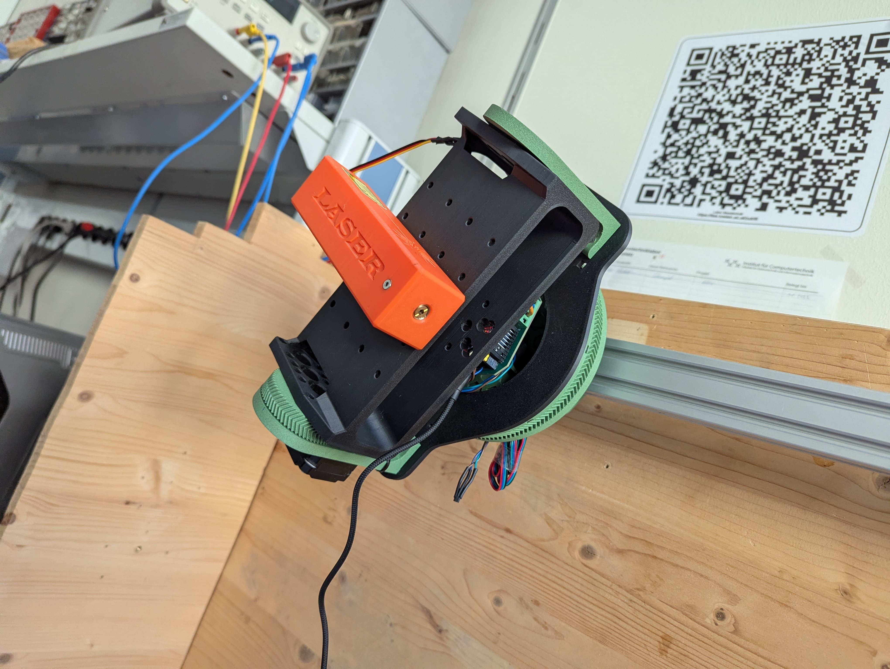

# Pan and Tilt mechatronical assembly
This project is based on the Micro-Ros module for Zephyr devolpped at https://github.com/micro-ROS/micro_ros_zephyr_module/tree/humble which has been tested in Zephyr RTOS v4.0.0 (SDK 0.16.9-rc3), and v4.1.0 (SDK 0.16.9-rc3), using a docker image based on 'zephyrprojectrtos/zephyr-build:v0.26.17'.

## Purpose of the Project
This project aims to drive a tilt-roll-slide assembly which will be deployed on a robot platform that will help in pest control. The assembly manages movement of a camera for data accumulation and also features a laser mount that can be used to terminate vermin. The prototype assembly can be seen below.

<div id="assembly" align="center">
  
  <p><em>Assembled prototype system allowing roll and tilt movement combined with sliding featureing a camera slot and laser pointer.</em></p>
</div>

## Disclaimer and Documentation
This project builds on the wonderful reference project by isaac hosted at https://github.com/isaac879/Pan-Tilt-Mount. It further builds on Zephyr and Micro-Ros. Note that this project is still in development so there might be things not working yet. A much more detailed explainaition of the project and its capabilities is located in the mdbook docu under [docu](./docu/src). Build it using the commands below and then open one of the html-files located in the new "book" folder:

```bash
cd docu
mdbook build
```

## Zephyr Setup
Get a working version of Zephyr 4.2 and the sdk-0.16.9-rc3 using the following part of the Getting Sarted guide (https://docs.zephyrproject.org/latest/develop/getting_started/index.html#get-zephyr-and-install-python-dependencies) and the technical note describing getting older versions (https://www.zephyrproject.org/managing-multiple-versions-of-the-zephyr-rtos/). 

### Installation Steps
Most relevant commands should be:

```bash
sudo apt update
sudo apt upgrade

# get dependecies
sudo apt install --no-install-recommends git cmake ninja-build gperf \
  ccache dfu-util device-tree-compiler wget python3-dev python3-venv python3-tk \
  xz-utils file make gcc gcc-multilib g++-multilib libsdl2-dev libmagic1

# verify versions, need in order at least 3.20.5, 3.12, 1.4.6
cmake --version
python3 --version
dtc --version

# prepare zephyr workspace
mkdir ~/zephyr_4_2
python3 -m venv ~/zephyr_4_2/.venv
source ~/zephyr_4_2/.venv/bin/activate

# get west 
pip install west

# get zephyr 4.2.0
west init -m https://github.com/zephyrproject-rtos/zephyr --mr v4.2.0 zephyr_4_2 
cd zephyr_4_2
west update

# get sdk 0.16.9-rc3
wget https://github.com/zephyrproject-rtos/sdk-ng/releases/download/v0.19.9-rc3/zephyr-sdk-0.16.9-rc3_linux-x86_64.tar.gz
tar xzvf zephyr-sdk-0.16.9-rc3_linux-x86_64.tar.gz
cd zephyr-sdk-0.16.9-rc3_linux-x86_64
./setup.sh
```

### Zephyr and Micro-Ros Source Code Changes
As the more recent stepper-features of Zephyr are relevant for the project, a newer version of Zephyr was required than the tested ones for Micro-Ros. However, the latest ones have undergone some major file-location changes which make adjustment of Micro-Ros cumbersome. A compromise was found in using Zephyr 4.2.0. It needed some minor addjustments explained in detail in the full documentation and specifically in the [zephyr chapter](./docu/src/zephyr.md). Further, as the used ESP32S3 devkitC offeres a second usb-port controlled in Zephyr via the node "usb_serial", some minor changes to some code in the [Micro-Ros library](./modules/libmicroros/microros_transports/serial/microros_transports.c) need be done as shown below:

```c
// original: #define UART_NODE DT_NODELABEL(usart1)
// adapted: 
#define UART_NODE DT_NODELABEL(usb_serial)
```

### Activate Zephyr Environment
Once everything is installed, the follwoing commands should activate your environment allowing you to build and flash zephyr code onto the esp32:

```bash
# if not activated, switch to virtual environment
source ~/zephyr_4_2/.venv/bin/activate
# activate zephyr commands and link correct sdk
source ~/zephyr_4_2/zephyr/zephyr-env.sh
export ZEPHYR_SDK_INSTALL_DIR=~/zephyr-sdk-0.16.9-rc3
```

### Building Zephyr Firmware
With a activated and sourced environemnt, building and flashing should be possible via the following commands

```bash
west build -p always -b esp32s3_devkitc/esp32s3/procpu
west flash
```

### Monitoring the Zephyr OS
The log messages from the esp32 and zephyr can be monitored with the following commands using a baudrate of 115200 but the port needs to be adapted of course:

```bash
west espressif monitor -b 115200 -p /dev/ttyACM0
```

## Micro ROS Setup

### Dependencies

This component needs `colcon` and other Python 3 packages in order to build micro-ROS packages:

```bash
pip3 install catkin_pkg lark-parser empy colcon-common-extensions
```


### Setup Ros-agent
Follow the steps described in the Quickstart and Building micro-ROS-Agent sections from https://github.com/micro-ROS/micro_ros_setup?tab=readme-ov-file#building to get a working ros-agent for the first time. Do not follow any firmware sections!


### Start ros-agent in Micro-Ros workspace via (if built at least once before)
```bash
source /opt/ros/humble/setup.bash
cd ~/uros_ws
source install/local_setup.sh
ros2 run micro_ros_agent micro_ros_agent serial --dev /dev/ttyACM1 -b 460800
```

## ROS2 setup
to interact with the micro-ros agent via ROS2, the vermin_collector_ros_msgs package needs to be built there too (ROS2 installation required, change "humble" against your respective version):

```bash
source /opt/ros/humble/setup.bash
cd ~/ros2_ws/src
git clone https://phabricator.ict.tuwien.ac.at/source/Vermin_Collector_ROS_Msgs.git

cd ~/ros2_ws
colcon build --packages-select vermin_collector_ros_msgs
source install/setup.bash

# verify it worked via
ros2 interface show vermin_collector_ros_msgs/msg/Command
ros2 interface show vermin_collector_ros_msgs/msg/Feedback

```

A command can be sent with the following exemplary lines (turns the pitch motor to one motor-revolution at 16 microsteps if it was at step 0 before) but note that without the specifier "--once" the command gets sent repeatedly in 1 second intervals:
```bash
ros2 topic pub --once /ESP32_Command vermin_collector_ros_msgs/msg/Command "{
  command_type: 1,
  step_goals: [3200, 0, 0],
  laser_duration_ms: 0,
  star_diameter: 0,
  scan_limit: 0,
  frequency_goals: [100, 100, 100],
  en_motors: [1, 1, 1],
  resolution: 16
}"
```

Listen to feedback by using the following lines:
```bash
ros2 topic echo /ESP32_Feedback
```

## Troubleshooting
Note that ordered TMC2209 drivers from amazon may be faulty and should be checked prior to using them by supplying 3.3 V to all the logic pins like MS1 and MS2 and as well as DIR and 0 V to the enable pin. It happened before that some drivers pulled over 100 mA of current through the logic pins which killed one of the used ESP32 boards. 

Always check the wiring of the stepper motors and if the coils are exposed as proposed. 

If the ESP32 does not act as commanded, check if the Feedback publisher is still active.


## License
This repository is open-sourced under the Apache-2.0 license. See the [LICENSE](LICENSE) file for details.

For a list of other open-source components included in ROS 2 system_modes,
see the file [3rd-party-licenses.txt](3rd-party-licenses.txt).

## Known Issues/Limitations

There are no known limitations.
