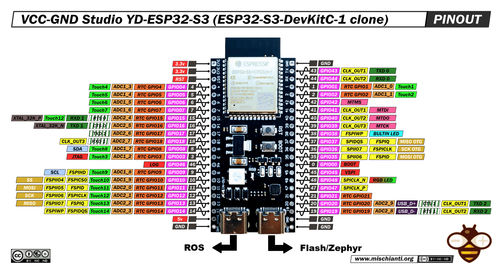
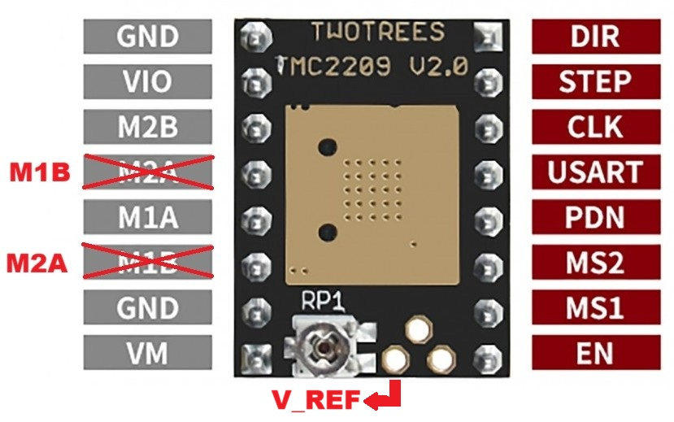
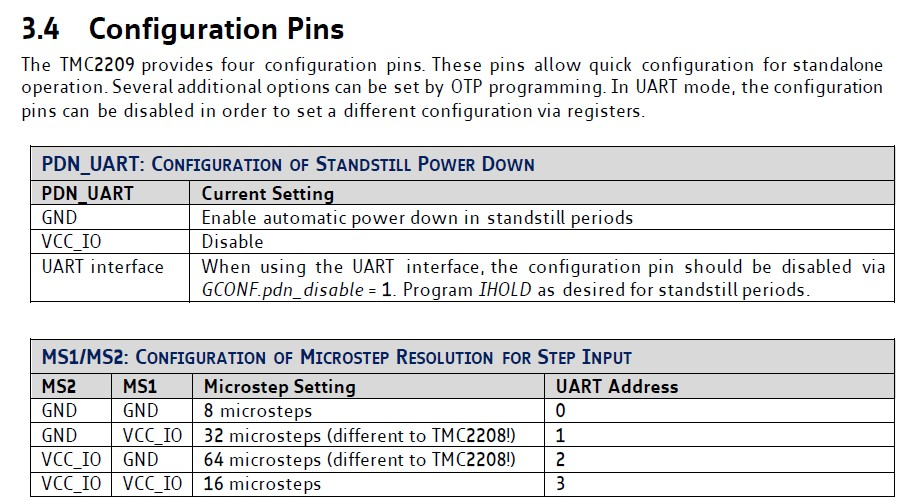
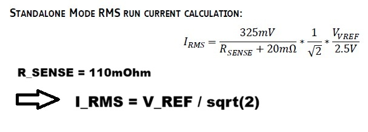
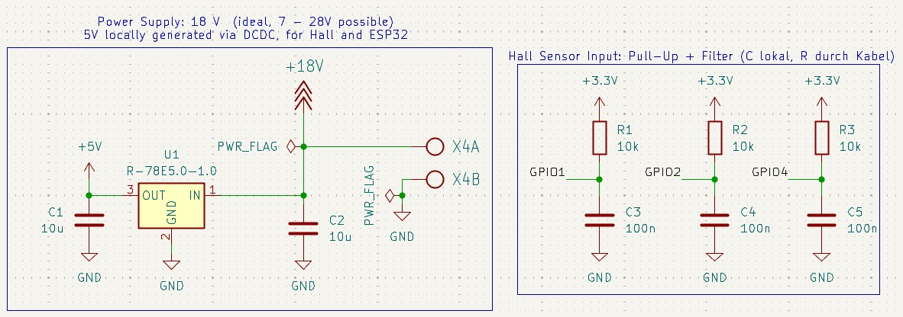
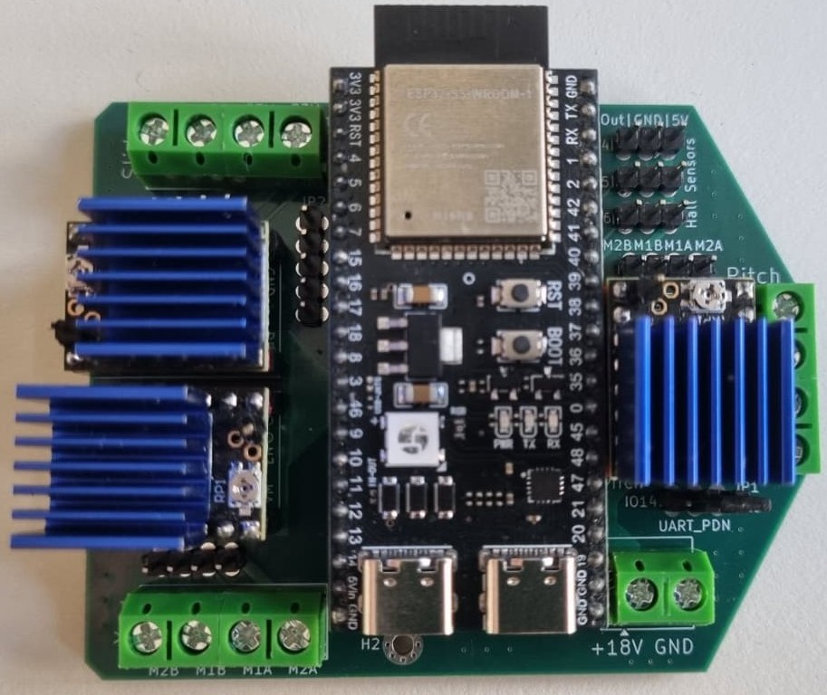

# Hardware Design
This chapter goes over the used microcontroller, stepper driver and hall sensors as well as introduces the schematic and layout design and finally lists the used stepper motors and their connectivity.

## Microcontroller ESP32-S3 DevKitC Clone
The used microcontroller seems to be a clone of the original Espressif microcontroller as the button placement is different compared to the image from the original website <a href="https://docs.espressif.com/projects/esp-dev-kits/en/latest/esp32s3/esp32-s3-devkitc-1/user_guide_v1.1.html#getting-started">https://docs.espressif.com/projects/esp-dev-kits/en/latest /esp32s3/esp32-s3-devkitc-1/user_guide_v1.1.html#getting-started</a>. Nevertheless, the probable pinout can be seen in [Figure 4](#esp32) below.

  
  
<em>Figure 4: Pinout of the used ESP32S3-DevKitC. Note that the RGB is located at GPIO48 instead of 38 as the official website mentions for newer versions. </em>

Several pins are occupied even though they are exposed. E.g. Pins 20 and 19 are connected to the differential USB data lines required for the ROS-USB to function. Pin 48 is connected to the RGB LED, and other pins also have special purposes. Therefore pins RST, 0 (BOOT), 3 (JTAG), 35 (MOSI OTG), 36 (SCK OTG), 37 (MISO OTG), 39 (MTCK), 40 (MTDO), 41 (MTDI), 42 (MTMS), 43(TX), 44 (RX), 45 (VSPI) and 46 (LOG) are not connected either in the PCB.

## Stepper Driver TMC2209
This stepper driver has been chosen for its simple step/dir interface while having suffcient microstep resolution of up to 64 microsteps per full steps. Its pinout can be seen in [Figure 5](#tmc2209) below.

  
  
<em>Figure 5: Pinout of the used stepper driver TMC2209. Note that the corrected pins in red have been confirmed via manual testing. The purchased driver appears to be a similar clone to the displayed "TWOTREES" driver board. </em>

The resolution can be set by driving two exposed pins MS1 and MS2. If higher resolution is necessary, the driver could be configured using a UART-PDN-pin. Note that this is just one pin on the actual driver but is exposed as two seperate pins on the purchased driver board, see [Figure 5](#tmc2209) above. This uart-programming has not been tested but is configurable via a jumper on the PCB. If this UART-PDN-pin is pulled low, an automatic standstill-current-reduction is enabled that avoids unnecessarily heating the driver. Details about these configurations can be taken from the datasheet snapshot in [Figure 6](#conf-pins) below.

  
  
<em>Figure 6: A snapshot from the original datasheet from Analog Devices stating the manual microstep-resolution configurations and the standstill-current-reduction. </em>

The RMS current for the motor can be set using a potentiometer on the driver board. The potentiometer scales the voltage "V_REF" which is exposed on the driver board and directly controls the allowed current. The required sensing resistor is already populated on the driver board and has 110 mOhms. According to the datasheet, the RMS current can then be calculated as stated below in [Figure 7](#i_rms).

  
  
<em>Figure 7: A snapshot from the original datasheet from Analog Devices stating the RMS current configuration using V_REF and a sensing resistor. The sensing resistor is populated on the driver board and has a value of 110 mOhms, which leads to the given simplifcation of the formula. </em>

## Schematic and Layout Design, Hall Sensor
Besides the simple connections of certain GPIOs of the ESP32 to the three driver boards (pitch-yaw-slide) and connections to pin headers and screw terminals, a few other blocks have been implemented which will be discussed in more detail. 

The full schematic is available [here](./pdfs/schematic.pdf). For mechanical homing, three hall sensors are implemented on the assembly. These hall sensors of the type a3144 have a digital output in open-drain configuration. Note that there is a higher sensitivity to a certain direction of the magnetic field! These sensors require a pull-up resitor and a 5V supply. As the logic of the ESP32 operates in the range 0-3.3 V, the 5 V - supply is generated using a R-78E5.0-1.0 DC-DC converter and only used for the supply pins of the hall sensors. The pull-ups on the other hand are connected to the 3.3 V supply pins of the ESP32. The signal pins of the hall sensores are connected to GPIOs of the ESP32 and to pull-ups as well as capacitors to debounce the signal. The supply-block and the hall-sensor-block is shown below in [Figure 8](#supply-hall). For future updates, a pin-header with five unused GPIOs is also available, though one of these will be used to control a laser. 

  
  
<em>Figure 8: A snapshot from the full schematic design. It shows the supply-block generating a 5 V output for the hall sensors. The hall-signal pins are connected to GPIOs of the ESP32 additionally to pull-up resitors and debouncing-capacitors. </em>

Further note that due to the limited number of available pins, the resolution can only be changed for all stepper motors together. On the other hand, they have individual enable GPIOs which allows the deactivation of indiviudal steppers. 

The full layout is available [here](./pdfs/layout.pdf). It feautures four layers with the second and fourth layer being mostly GND-planes. It was designed to fit into the mechanical clamps prepared on the assembly. The rounded right side was intended to better fit the round opening through which the PCB has to fit to get to its final psoition. The populated board can be seen in [Figure 9](#board) below. 

 

  
  
<em>Figure 9: The populated final PCB. Note that the driver boards and the ESP32 are stacked on the board using pin-headers. Therefore, there was some room available below the ESP32, so the DC-DC converter aswell as some capacitors and resitors have been placed there.  </em>

## Stepper Motors ToDo : Check actual cables and maximum currents
	
For the pitch and yaw axes, smaller NEMA motors are used: **17HS08-1004S**, allowing up to 1A of phase current.  
For the slide axis, a larger NEMA motor is used: **17HE15-1504S**, allowing up to 1.5A of phase current.  

The stepper motors must be connected to the drivers as follows:  

| Stepper Driver | Small Motor       | Large Motor     |
|:--------------:|:-----------------:|:---------------:|
| M2B            | Red               | Green           |
| M1B            | Blue              | Red             |
| M1A            | Green             | Blue            |
| M2A            | Black             | Black           |
