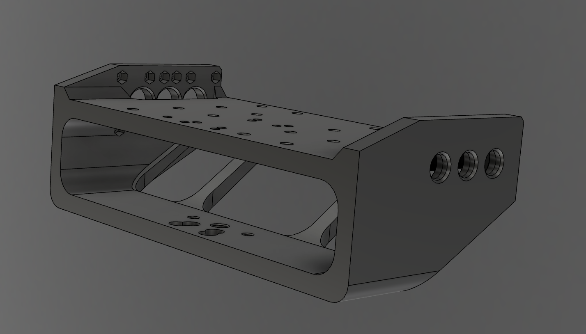
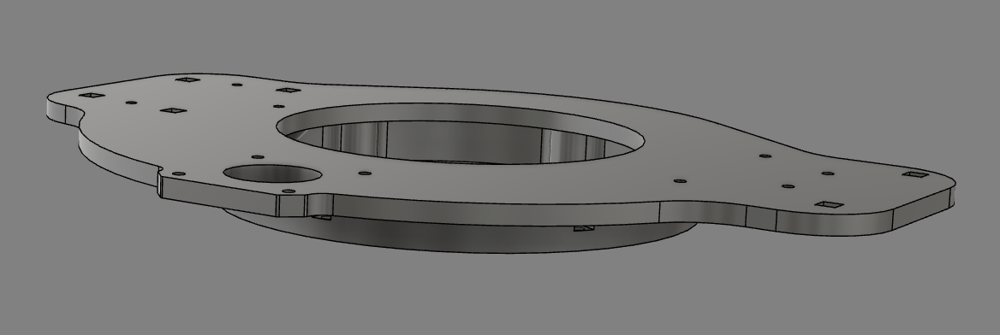
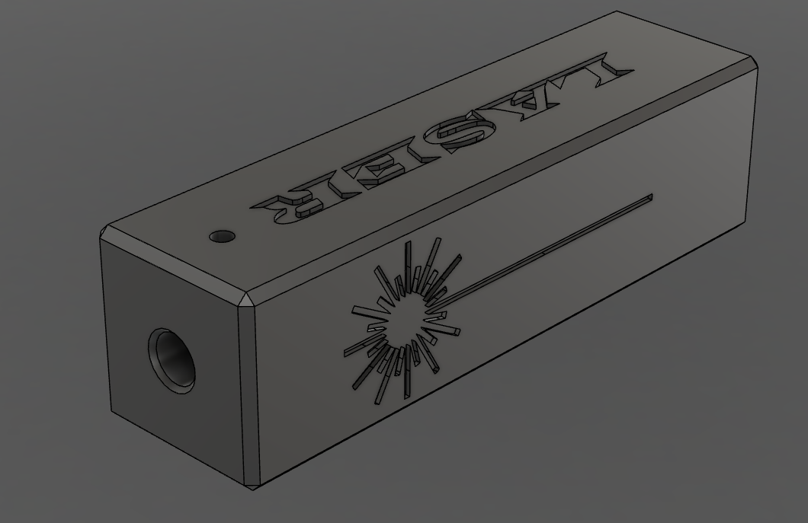
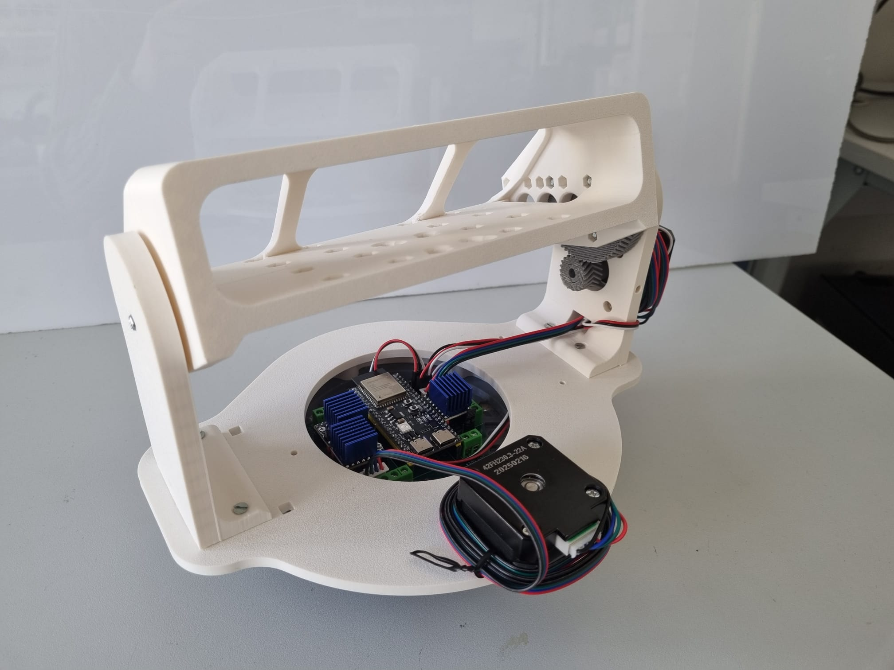
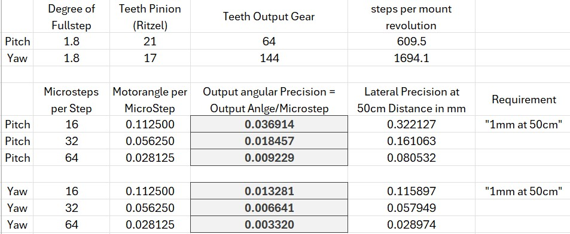
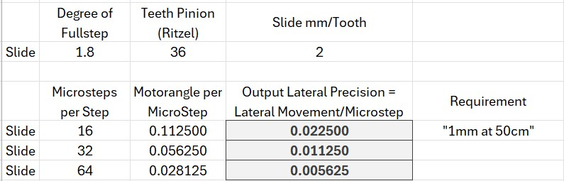

# Mechanical Design
This chapter introduces some details to the mechanical design. It is mostly based on this [youtube series](https://www.youtube.com/watch?v=uJO7mv4-0PY).

## Tilt Mount (Pitch motor)
The tilt mount is completey reworked to firmly house the ZED2i stero camera inside and a powerful (multiple Watts) Laser ontop. It also offers 3 differnt holes for mouning to allow for a balanced center of mass with different setups. A 3D rendering can be seen below in [Figure 10](#tilt-mount).

  
  
<em>Figure 10: 3D rendering of the tilt mount holding the camera. </em>

## Pan Mount
The Pan mount is widened to allow the stereo camera to fit, as shown below in [Figure 11](#pan-mount).

  
  
<em>Figure 11: 3D rendering of the pan mount, which is the base holding both the PCB and the full tilt mount. </em>

## Laser Housing
A enclosure is designed to give a small 1mW "Arduino Laser" the same dimensions as the powerful lasers used in the final assembly. This allows for safe testing. A rending of the design is shown below in [Figure 12](#laser-mount).

  
  
<em>Figure 12: 3D rendering of the laser housing, suited for both a 1mW Arduino Laser and a more powerful laser for the final application of vermin termination. </em>

## Full assembly 
The full assembly is shown below in [Figure 13](#proto-assembly). The only things missing are the slide mount which is still in design as well as the camera and the laser which have not yet been mounted. The ESP32 is also missing the usb cables necessary for communication.

  
  
<em>Figure 13: The prototype assembly with the mounted PCB and both the pan and tilt motors. The usb cables, the camera and the laser mount are missing and the slide mount is not shown either. </em>

## Hall Sensor Tips
The used a3144 digital hall sensors do not have a strong sensitivity but there is a preferred direction of the magnitc field. Be awere of that before glueing any of the magnets and test it beforehand with the hall sensors in their final configuration. Further, the tilt (pitch motor) hall sensor mount is not suitable as planned by the [reference project](https://github.com/isaac879/Pan-Tilt-Mount) because the sensor is not sensitive enough to recognize the magnetic field. There fore the sensor had to be put manually closer to the magnet mount to get a sufficently strong signal.

## Positioning Accuracy
In this section, the achievable accuracies for all mounts is given for different microstep resolutions, see [Figure 14](#pitch-yaw-accuracy) and [Figure 15](#slide-accuracy). Note again that the resolution for all steppers is synchronous due to limited GPIOs available on the ESP32. Further note that these are calculations and may be limited by mechanical inaccuracies.

  
  
<em>Figure 14: Proposed angular accuracy of the pitch and yaw mounts for different microstep resolutions. </em>

  
  
<em>Figure 15: Proposed lateral accuracy of the slide mount for different microstep resolutions. </em>

