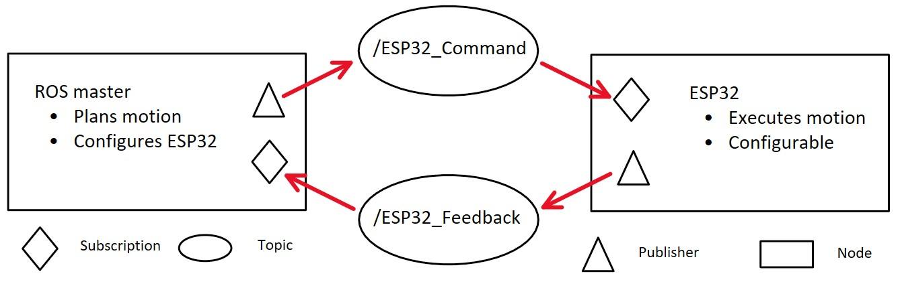
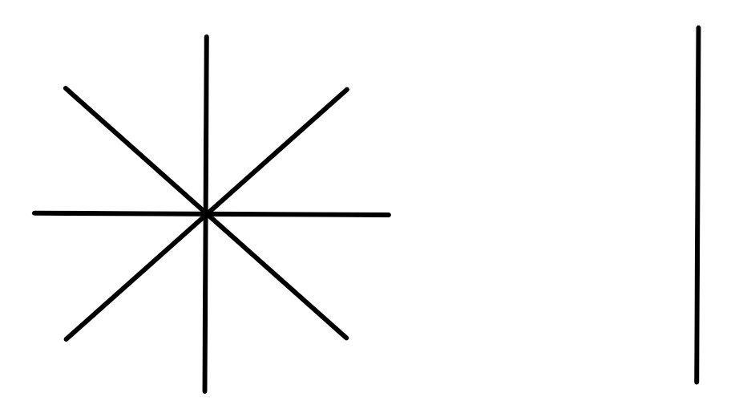

# Topics and messages
The communication between ROS master and the ESP32 is managed using publisher and subscriber to two specific topics:
- /ESP32_Command
- /ESP32_Feedback

Specifically, the ROS master subscribes to the /ESP32_Feedback topic to get information about the controller state, the motor positions and the current configuration as the ESP32 publishes these. Vice versa, the ROS master publishes to the /ESP32_Command topic, to order the controller to execute certain movements or change the configuration as it subscribes to this topic. [Figure 2](#topics) 


<div id="topics" align="center">
  
  <p><em>Figure 2: Communication flow between nodes using publications and subscriptions to the two topics /ESP32_Command and /ESP32_Feedback.</em></p>
</div>

## Custom Messages
The custom messages built in [ROS2 and microros setup](./ros.md) are explained here now in more detail.

### Command Message
The "Command" message is used to control the ESP32 from the ros master. Its structure is given below:
```
# Command type (enum)
uint8 SETUP=0
uint8 TARGET=1
uint8 HOMING=2
uint8 HARD_HOMING=3

uint8 command_type

int32[3] step_goals # Position (microsteps, order is pitch, yaw, slide)

uint32 laser_duration_ms # Laser duration (ms)

# Star-diameter and scan-limit in microsteps
uint32 star_diameter
uint32 scan_limit

uint16[3] frequency_goals # Microstep frequencies (Hz)

uint8[3] en_motors # Enable Motors

uint8 resolution # Resolution (8,16,32,64)
```


It containes a type, indicating which task the ESP32 has to perform. The "HOMING" and "HARD_HOMING" tasks tell the ESP32 to move the motors back to the reference position. The difference between the two is, that the "HARD_HOMING" sequence first starts by moving all motors one by one for a full revolution. By doing so, the hall sensors are used to find the magnetic reference postion. After those revolutions, the motors are moved to the newly calibrated reference position. The simply "HOMING" returns to a prior set reference position without new calibration. A "HARD_HOMING" should be performed each time when the system is activated. Further "HARD_HOMING"s may be used if a lot of steps are lost due to mechanical problems. The system does not start a "HARD_HOMING" sequence by itself at start-up to avoid any damage due to unintended power-up. No further message parameters are processed when receiving a "HOMING" or "HARD_HOMING" command.

The "SETUP" task uses the "en_motors" and "frequency_goals" arrays to enable the specified motors with the given frequency in Hz. Order is always pitch-yaw-slide or also known as pan-tilt-slide. The "resolution" is the same for all motors and therefore only given once. By default, the system enables all motors with a frequency of 100 Hz and a resolution of 16 micro-steps after start up. No further target parameters are processed when receiving a "SETUP" command.

The "TARGET" task tells the ESP32 to move the motors by the specified "step_goals" array (order pitch-yaw-slide), so they can be negative to change the direction. Once the specified steps are finished, the parameters "star_diameter" defines the subsequent behaviour. If it is larger than zero, the given step amount is used in the form of a radius of a star pattern, see [Figure 3](#patterns) combining the movements of the pitch and yaw motors. If it is zero, the "scan_limit" is processed. If it is larger than zero, the pitch moves the specified steps up and down executing a scanning motion. During the execution of a star pattern, the laser is activated the whole time. For simple scanning, the "laser_duration_ms" must be zero. It should only have a value if the laser shall be pointed for a specified time at a simple target defined by the "step_goals". No further setup parameters are processed when receiving a "TARGET" command.


<div id="patterns" align="center">
  
  <p><em>Figure 3: Left: Star pattern performed by the pitch and yaw motor together using the "star_diameter" parameter as radius. Right: The scan movement performed by the pitch motor alone using the "scan_limit" paramter as half the drawn distance. </em></p>
</div>

### Feedback Message
The feedback is publsihed regularly in one second intervals to the /ESP32_Feedback topic by the microcontroller to allow the master to plan. The master can use the provided information to schedule its commands, e.g. only when the "state" is "READY". It can use the "current_steps" array information to plan further movements and enforce any missed commands. Finally, the "frequencies", "en_motors" and "resolution" information can be used to ensure the proper configuration and also plan movements on degree level by scaling steps accoringly. Look into the chapter [Mechanical Design](./mech.md) for position scaling between steps and degrees.

```
# State enum
uint8 READY=0
uint8 CONFIGURING=1
uint8 MOVING=2
uint8 CALIBRATING=3

uint8 state

int32[3] current_steps # Current microstep Position (order is pitch, yaw, slide)

# Current settings and motor state
uint16[3] frequencies
uint8[3] en_motors
uint8 resolution
```


### Command line communication
To publish a command or listen to a topic from the command line, source the ROS2 environment:
```bash
source /opt/ros/humble/setup.bash
cd ~/ros2_ws
source install/setup.bash
```

A command can be sent with the following exemplary lines (turns the pitch motor for one motor-revolution at 16 microsteps) but note that without the specifier "--once" the command gets sent repeatedly in 1 second intervals:
```bash
ros2 topic pub --once /ESP32_Command vermin_collector_ros_msgs/msg/Command "{
  command_type: 1,
  step_goals: [3200, 0, 0],
  laser_duration_ms: 0,
  star_diameter: 0,
  scan_limit: 0,
  frequency_goals: [100, 100, 100],
  en_motors: [1, 1, 1],
  resolution: 16
}"
```

Listen to feedback by using the following lines:
```bash
ros2 topic echo /ESP32_Feedback
```